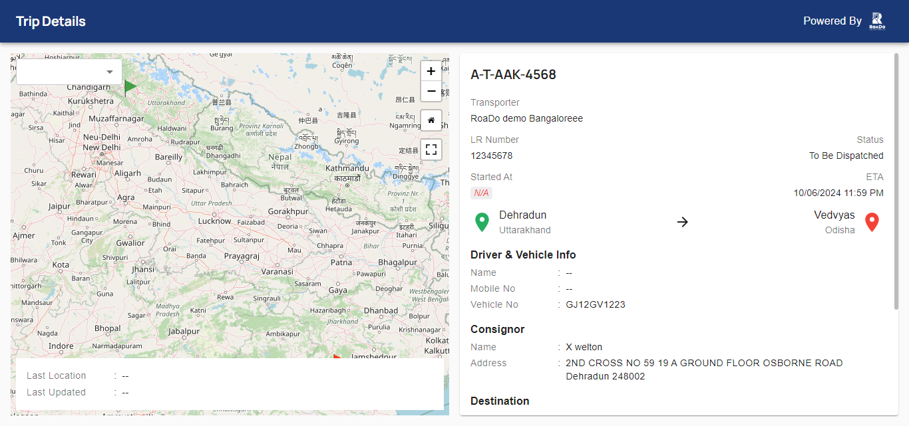

# Fleet-API-Integration

## By Using fetchByLRNo query

## Success Tracking Screenshot.



### Equivalent HTTP Request
1. Method - POST
2. URL - https://api.roado.co.in/fleet/api

3. Implement Html Code.

```
<section class="section_main pad-80">
    <div class="container-fluid">
        <div class="inner_page">
            <div class="track_box">
                <form action="" method="POST" id="trackform">
                    <input type="text" name="tracking_no" id="tracking_no" placeholder="Track LR No.">
                    <button type="button" name="submit" id="track-submit">Track Now</button>
                </form>
                <p class="empty-message error-msg" style="color:red;display:none;">LR Number Required.</p>
                <h3 class="error-message error-msg" style="color:red;display:none;">Record Not Found !</h3>
            </div>
        </div>
    </div>
</section>

```

4. Implement Validation Script Code..

```
<script>
    jQuery(document).ready(function(){
        // $(".error-message").hide();
        $("#track-submit").click(function(){
            
            let track_data = $("#tracking_no").val();
            if(track_data)
            {
              $(this).text("Loading...");
              $.ajax({
              url:"<?= admin_url("admin-ajax.php")?>",
              method:"POST",
              data:{action:"get_tracking_ajax",track_data:track_data},
              success:function(res){
                  console.log(res);
                  if(res=="Empty")
                  {
                     $("#track-submit").text("Track Now");
                     $(".error-message").css("display", "block");
                     $(".empty-message").css("display", "none");
                     $("#tracking_no").val('');
                     
                     
                  }else{
                      window.open(res,"_blank");
                      setTimeout(function() {
                                location.reload(true);
                            }, 500);
                  }
              }
            });  
            }else{
                $(".empty-message").css("display", "block");  
            }
            
            
        });
    });
</script>
```


5. Implement Api Integration Code inside wordpress functions.php file..
```
function get_tracking_ajax()
{
    if(!empty($_POST['track_data']))
    {
        // print_r($_POST['track_data']);
        // echo "okay";
        // die();
        $api_url = 'https://api.roado.co.in/fleet/api';
        $api_key = 'bbda2d97b83f4f3085c48394b136e1a1'; 
        $lr_number = $_POST['track_data']; 
        
        // Prepare the request data
        $request_data = [
            'variables' => ['lrNumber' => $lr_number],
            'query' => 'query ($lrNumber:String!){ fetchByLRNo(lrNumber: $lrNumber) { uid status destination {address {address} } shareLink } }',
        ];
        
        // Initialize cURL session
        $ch = curl_init($api_url);
        
        // Set cURL options
        curl_setopt($ch, CURLOPT_RETURNTRANSFER, true);
        curl_setopt($ch, CURLOPT_HTTPHEADER, [
            'Content-Type: application/json',
            'authkey: ' . $api_key,
        ]);
        curl_setopt($ch, CURLOPT_POST, true);
        curl_setopt($ch, CURLOPT_POSTFIELDS, json_encode($request_data));
        
        // Execute cURL session and get the response
        $response = curl_exec($ch);
        
        // Check for cURL errors
        if (curl_errno($ch)) {
            echo 'Curl error: ' . curl_error($ch);
        }
        
        // Close cURL session
        curl_close($ch);
        
        // Process the API response
        if ($response) {
            $decoded_response = json_decode($response, true);
        
            if (isset($decoded_response['data']['fetchByLRNo']['shareLink'])) 
            {
                echo $decoded_response['data']['fetchByLRNo']['shareLink'];
            } 
            else{ echo 'Empty'; }
            
        } else { echo 'Empty'; }

    }else{
        echo 'Empty_data';
    }
    
    wp_die();
}
add_action( 'wp_ajax_nopriv_get_tracking_ajax', 'get_tracking_ajax' );  
add_action( 'wp_ajax_get_tracking_ajax', 'get_tracking_ajax' );
```